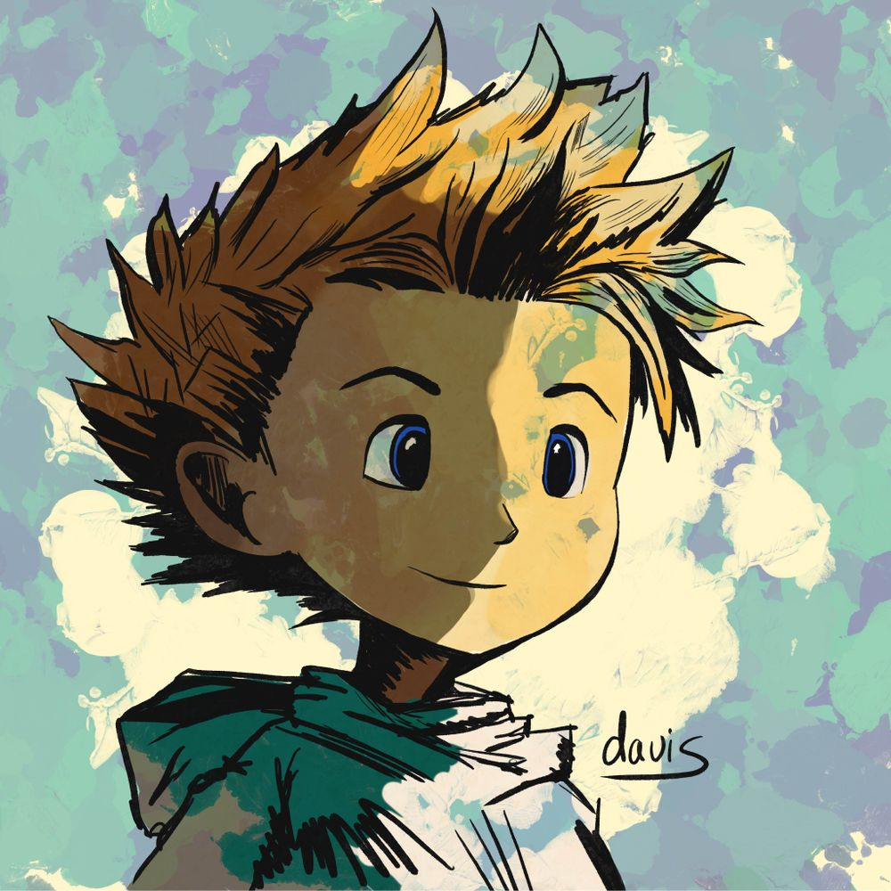

# recordName

> This is the feed's ID which can be letters, numbers, or dashes. Spaces are not allowed. Maximum length is 15 characters.

davis-pinned-posts

# isEnabled

> Whether this feed should be published by the "Publish Feed Generators" step. Set to `true` or `false`.

true

# displayName

> This is the title of the custom feed. Maximum length is 24 characters.

Davis' Pinned Posts

# description

> This is the description of the feed.

Pinned posts of @davis.social :)

# searchTerms

> There are three types of search terms:
>
> - Keywords: Test these in [https://bsky.app/search](https://bsky.app/search). `AND` is implicit, so `cat dog` on one line will require both `cat` and `dog`. You can use quotes as well `"hot dog"`.
> - Users: links such as `https://bsky.app/profile/why.bsky.team` will pull in the user's posts. To include replies and reposts, you can add the following flags: `https://bsky.app/profile/why.bsky.team +replies +reposts`.
> - Pinned posts: links such as `https://bsky.app/profile/saddymayo.bsky.social/post/3jxju2wwap22e` will pin at the top of the feed. One link per line, please.

> intro post
- https://bsky.app/profile/davis.social/post/3k27akjusde2j
> if you need me, I'll be in my mind post
- https://bsky.app/profile/davis.social/post/3jz3qfgbhz22z
> neil gaiman quote post of - if you need me, I'll be in my mind post
- https://bsky.app/profile/neilhimself.neilgaiman.com/post/3jz42tfqrke2z
> pug rincewind
- https://bsky.app/profile/davis.social/post/3jzvuibkspa26
> self notifying
- https://bsky.app/profile/davis.social/post/3jyyrtpupd32y
> portfolio day
- https://bsky.app/profile/davis.social/post/3k2awrrtkbn2u
> discworld death
- https://bsky.app/profile/davis.social/post/3k27qgpabba2m
> slaughter melon
- https://bsky.app/profile/davis.social/post/3k2qeuoecvl2i
> grumpy birb
- https://bsky.app/profile/davis.social/post/3jxlfxx5n4p23
> dracarys pig
- https://bsky.app/profile/davis.social/post/3jzlktivv6w2i
> james hurley head
- https://bsky.app/profile/davis.social/post/3jxzgngeh2i2s

# safeMode

> Safe mode limits the total number of API calls coming from Cloudflare.
>
> Set to `false` if you have higher limits via a paid Cloudflare plan.

true

# avatar

> This must link to an image (PNG or JPEG) in the same directory as this CONFIG.md. It doesn't have to be called `avatar2.png`, but just be sure this CONFIG.md points to the correct file.

